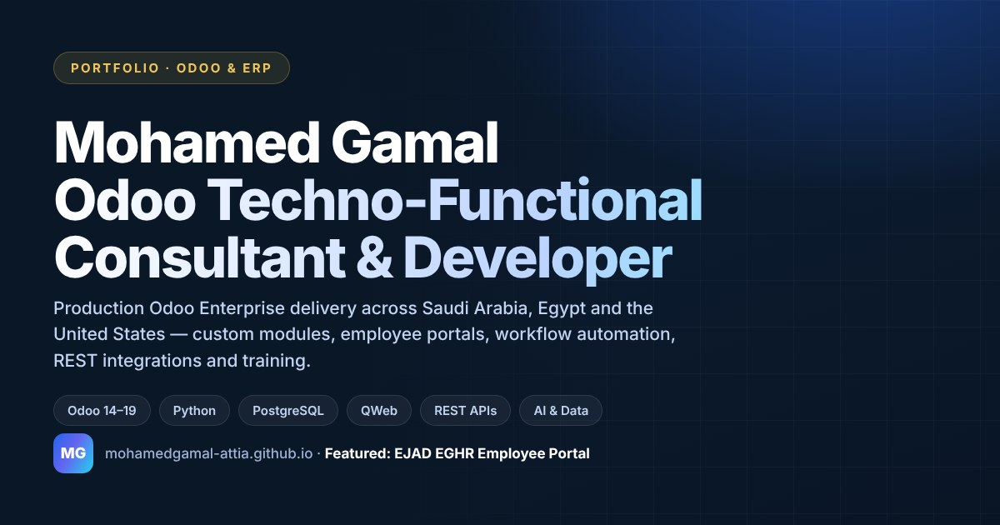

# Mohamed Gamal — Senior Software Engineer & Odoo / ERP Specialist

Portfolio site, plus the long-form case study for the **EJAD EGHR Enterprise Employee Portal**.

Senior Software Engineer and Odoo / ERP specialist — **4+ years**, **Odoo 14–20**, delivery
across Saudi Arabia, Egypt and the United States. ERP and portals are the deepest
specialisation; the work also covers web applications, backend services and APIs,
integrations, automation and data engineering.

**Live:** https://mohamedgamal-attia.github.io/mohamed_gamal_portfolio/
**EGHR case study:** https://mohamedgamal-attia.github.io/mohamed_gamal_portfolio/projects/eghr.html



---

## Design system

### Two palettes, and the line between them

The portfolio is the **gallery**; each project is the **artwork**. The gallery has one
consistent room — the palette below. The artwork keeps its own colours.

The portfolio palette dresses navigation, typography, rules, personal CTAs, card frames and
the footer. It is never painted onto a project's screenshots, logos or covers. Project
colour arrives separately, through `--pj-*` custom properties set per card from
`assets/data/projects.json`, and through `--cs-accent` on a case-study page.

| Role | Token | Value |
|------|-------|-------|
| Page floor / hero / footer | `--bg-deep` | `#171717` (Ink) |
| Light page | `--bg-page` | `#faf7f1` (Paper) |
| Raised dark surfaces | `--surface-dark-1..3` | `#1d1b1a` → `#302c2a` (Warm Charcoal) |
| Warm ivory surface | `--surface-3` | `#f3efe6` |
| Primary accent (dark surfaces) | `--accent-primary` | `#c99a57` (Personal Gold) |
| Primary accent (light surfaces) | `--accent-deep` | `#653b46` (Deep Burgundy) |
| Secondary accent | `--accent-secondary` | `#a7b0a1` (Muted Sage) |
| Muted text | `--text-muted` | `#6b655e` |

Gold is 7.0:1 on ink but only 2.4:1 on paper, so it is a dark-surface accent and never
light-surface body text; burgundy (8.7:1 on paper) carries the light surfaces.

### Project colour

Each project records its own accent and where that colour came from:

| Project | Accent | Source |
|---|---|---|
| EJAD EGHR | `#0e7390` | EJAD product teal |
| EJAD Digital | `#0e7390` | EJAD product teal |
| EjadTech | `#007a71` | sampled from the real EjadTech Odoo backend screenshot |
| DOTec | `#0019d3` | sampled from the real DOTec logo (`#001ad3`) |
| Margins | `#8b1919` | from the Margins placeholder mark — no real logo is public |
| Sunbelt Deals | `#543c24` | sampled from the real site capture |
| BlueDez | `#002348` | sampled from the real site capture |

Accents paint hairlines, small type and arrows. No screenshot is filtered or hue-rotated and
no logo is recoloured. Where a logo sits on a dark plate it is because the artwork is white
or near-white ink and would otherwise be invisible — the plate is a contrast surface, not
branding.

Type is **Fraunces** for display (the editorial voice) and **Inter** for interface. Motion
tokens — durations, easing and the depth ramp — live in `assets/css/motion.css` behind a
`prefers-reduced-motion` override that switches every effect off.

Generated artwork reads from the same palette: both `scripts/generate_*_visuals.py` files
pull their colours from it, so a palette
change propagates to the images without hand-editing SVG.

---

## Featured work

| Project | Type | Stack | Detail |
|---------|------|-------|--------|
| **EJAD EGHR — Enterprise Employee Portal** | Case study | Odoo 18 · Python · QWeb · PostgreSQL · Playwright | [projects/eghr.html](projects/eghr.html) |
| Margins Real Estate ERP | Full ERP build | Odoo 17 · Python · PostgreSQL · QWeb | in-page modal |
| DOTec Engineering ERP | Full ERP build | Odoo 18 · Python · PostgreSQL · REST API | in-page modal |
| EjadTech — Government Digital Transformation | Odoo delivery | Odoo · Python · QWeb | in-page modal |
| EJAD Digital Solutions — Odoo Enterprise Delivery | Odoo delivery | Odoo 17/18 · Python · QWeb | in-page modal |
| Sunbelt Deals — Website asset curation | Digital delivery | Image pipeline · WebP | in-page modal |
| BlueDez — Engineering blog content pack | Digital delivery | Content design · PDF | in-page modal |

---

## EGHR case study

A dedicated page at `projects/eghr.html` covering the portal end to end: the business
problem, my role, the design system, dashboard, request centre, attendance (including the
full geofence state machine), the eleven employee services, announcements, Arabic/English
and light/dark, mobile, architecture, engineering highlights and QA.

### About its visuals

The screens on that page are **interface schematics, not screenshots**. They encode the
delivered portal's layout, information architecture, RTL mirroring, light/dark surfaces and
attendance states; they do not reproduce live HR records, because real captures contain
employee data. The page labels each one and says so in an on-page note.

They are generated — rerun after editing the generator:

```bash
python3 scripts/generate_eghr_visuals.py
```

To replace them with real captures, run the capture script from a machine that can reach a
running EGHR instance, signed in as a demo/QA account. It masks personal-data selectors,
writes optimised WebP next to the schematics, and repoints `projects/eghr.html` at them:

```bash
pip install playwright pillow && playwright install chromium
export EGHR_URL=<the portal's local URL>
export EGHR_DB=<the local database name>
export EGHR_USER=<a demo/QA account>
export EGHR_PASSWORD=...                 # from the environment; never commit it

python3 scripts/capture_eghr_screenshots.py --list   # review the plan first
python3 scripts/capture_eghr_screenshots.py
```

Check every capture by eye for personal data before committing.

---

## Homepage structure

Proof first, then the offer, then the person:

`Hero → Selected work → What I build → Experience & delivery → How I work → Start a project`

Every project card is rendered from the same `projects.json` entry, so
the case study is described in exactly one place.

---

## Tech stack

Static HTML, CSS and vanilla JS — no framework, no build step. Content for the project and
company grids is data-driven from `assets/data/*.json`, rendered by `assets/js/data-loader.js`.

| Layer | Notes |
|-------|-------|
| Markup | Two pages: `index.html` and `projects/eghr.html` |
| Styles | CSS custom properties; each partial is `<link>`-ed directly (an `@import` manifest serialised the downloads) |
| Motion | Shared duration/easing/depth tokens in `assets/css/motion.css`, with a `prefers-reduced-motion` override |
| Depth | `assets/js/hero.js` puts each hero layer on its own Z plane, so the pointer parallaxes the plate, portrait and chip independently rather than tilting one flat image. Max rotation 5°. |
| Behaviour | Vanilla JS modules, each guarded for reduced motion and coarse pointers |
| Images | Generated SVG (tiny, crisp at any size) plus real photo/asset packs; everything lazy-loaded below the fold |
| Social | Open Graph / Twitter cards generated into `assets/images/og/` |

---

## Run locally

```bash
python3 -m http.server 8000
# http://localhost:8000
```

> The site uses CSS `@import` and `fetch()` for JSON, so it needs an HTTP server.
> Opening `index.html` over `file://` will not work.

Everything is relative-path only, so it works unchanged under the
`/mohamed_gamal_portfolio/` GitHub Pages sub-path.

---

## Checks

```bash
python3 scripts/validate_project.py      # JSON parses, assets resolve, anchors resolve, no external 
```

The repository was also checked with a Playwright audit covering eleven viewports
(360–1920) on both pages: horizontal overflow, text overlap and clipping, broken or
distorted images, console errors, dead links and dead fragments.

---

## Project Structure

```
mohamed_gamal_portfolio/
├── index.html                       # Homepage
├── projects/
│   └── eghr.html                    # EGHR case study
├── my_img.png                       # Portrait
├── 0_Mohamed_Gamal_CV.pdf           # Downloadable CV
│
├── assets/
│   ├── css/
│   │   ├── variables.css            # Colour / radius / shadow tokens
│   │   ├── motion.css               # Duration, easing, depth + reduced-motion
│   │   ├── base.css · layout.css    # Reset, typography, container, grids
│   │   ├── components.css           # Buttons, nav, modal, badges, skeletons
│   │   ├── sections.css             # Per-section homepage styles
│   │   ├── futuristic.css           # Aurora, kinetic type, glass, reveal
│   │   ├── project-showcase.css     # Project cards, bento grid, context chips
│   │   ├── carousels.css
│   │   ├── responsive.css           # Breakpoints
│   │   └── case-study.css           # Case-study page only
│   │
│   ├── js/
│   │   ├── config.js                # window.Portfolio namespace
│   │   ├── animations.js            # Navbar, reveal, counters, mobile menu
│   │   ├── effects.js · tilt.js · carousels.js
│   │   ├── modals.js                # Project modal (tabs, gallery, focus trap)
│   │   ├── filters.js · data-loader.js · main.js
│   │   └── case-study.js            # Gallery, lightbox, compare switches, progress
│   │
│   ├── data/                        # profile / companies / case-studies / projects / sources
│   │
│   └── images/
│       ├── favicon.svg
│       ├── og/                      # Social preview cards
│       ├── companies/               # Company logos
│       └── projects/
│           ├── eghr/                # EGHR interface schematics + card cover
│           ├── generated/           # Generated ERP product visuals
│           ├── bluedez/ · sunbelt/  # Real project asset packs
│           └── *.svg
│
└── scripts/
    ├── generate_eghr_visuals.py     # Builds the EGHR schematics
    ├── capture_eghr_screenshots.py  # Replaces them with real captures
    ├── generate_project_visuals.py  # Builds the other project covers
    ├── validate_project.py          # Pre-flight checks
    ├── download_assets.py           # Company logo refresh
    └── audit_portfolio_data.py
```

---

## How to Edit Content

### Personal Info
Edit `assets/data/profile.json`. Changes apply to `config.js` (which references the same data) and to sections rendered from JS.

To also update the hardcoded contact section in `index.html`, search for the `#contact` section and update the anchor tags there directly.

### Companies
Edit `assets/data/companies.json`. The company cards section (`#companies`) is fully rendered by `data-loader.js` — no HTML editing needed.

Each company object:
```json
{
  "slug": "ejadtech",
  "name": "EjadTech",
  "country": "Saudi Arabia",
  "industry": "Digital Transformation · Government IT",
  "role": "Odoo Developer",
  "logo": "assets/images/companies/ejadtech-logo.png",
  "logoFallback": "assets/images/companies/ejadtech-placeholder.svg",
  "website": "https://ejadtech.sa/",
  "description": "..."
}
```

### Project Cards
Edit `assets/data/projects.json`. The `#work` grid is fully rendered by `data-loader.js`.

Key fields per project:
| Field | Purpose |
|-------|---------|
| `id` | Used as the `data-modal` trigger key |
| `type` | `"erp-system"` / `"odoo-work"` / `"public-context"` / `"website-project"` / `"content-project"` — drives badge and border styling |
| `categories` | Array of filter keys (e.g., `["erp-systems", "real-estate-erp"]`) |
| `roleNote` | Shown in modal for `public-context` cards as a blue callout |
| `sourceUrl` | Enables "View Official Source" button in modal |
| `sourceLinkLabel` | Label for the source button |
| `cardDesc` | Short description shown on the card (120 chars max) |
| `sectorLabel` | Sector label shown in card footer |
| `cover` | Card thumbnail (the validator checks it resolves) |
| `caseStudyUrl` | When set, the whole card becomes a link to that page instead of opening the modal |
| `caseStudyLabel` | CTA wording for such a card (default `Case Study`) |
| `size` | `large` / `wide` (two grid columns), or `medium` (one) |

### Featured Case Studies
Edit `assets/data/case-studies.json`. These populate the `#featured` section cards (currently hardcoded in HTML for richer layout). To make featured cards dynamic too, update `data-loader.js` with a `renderCaseStudies()` function.

### Filter Tabs
The filter tab categories and labels are defined in `assets/js/config.js` under `filterTabs`. The HTML filter buttons in `index.html` (`#work` section) must match these values in `data-filter` attributes.

Current categories:
- `all` — All projects
- `erp-systems` — Complete ERP builds (Margins, DOTec)
- `odoo-work` — Odoo contributor work (EjadTech, EJAD Digital)
- `real-estate-erp` — Real estate domain
- `engineering-erp` — Engineering domain
- `digital-transformation` — KSA digital transformation
- `public-context` — Company reference context cards
- `digital-delivery` — Website & digital delivery projects (Sunbelt, BlueDez)
- `web-projects` — Website / frontend projects (Sunbelt)
- `content-projects` — Content & branding projects (BlueDez)

### Styles
- Global tokens (colors, shadows, spacing): `assets/css/variables.css`
- Layout helpers: `assets/css/layout.css`
- All components (buttons, modal, form, badges): `assets/css/components.css`
- Per-section styles: `assets/css/sections.css`
- Mobile breakpoints: `assets/css/responsive.css`

---

## Project Types & Honesty Model

The portfolio uses explicit project types to be transparent about the nature of each listing:

| Type | Meaning | Visual |
|------|---------|--------|
| `erp-system` | Complete Odoo ERP system built from scratch by me | Gold badge "Full ERP Build" |
| `odoo-work` | Odoo/ERP backend contributor on company client projects | Blue badge "Odoo Work" |
| `public-context` | Company's public projects shown as **business domain context only** — my direct role was building the internal ERP, not these projects | Dashed border, grey badge, role note in modal |
| `website-project` | Website / frontend / digital delivery work — **not** an ERP build (Sunbelt Deals website asset curation) | Green badge "Website & Frontend" |
| `content-project` | Content design / branding delivery — **not** an ERP build (BlueDez engineering content pack) | Purple badge "Content & Branding" |

A disclaimer banner at the top of `#work` explains this to visitors. Odoo/ERP remains the core identity; the website and content projects are listed honestly as additional digital-delivery work.

### Recent Digital Projects (BlueDez & Sunbelt)

Two non-ERP projects are included in the `#work` grid and filterable via **Website & Digital Delivery**, **Web Projects**, and **Content & Branding** tabs:

| Project | id | Type | Images |
|---------|----|------|--------|
| Sunbelt Deals – Website Image & Asset Curation | `sunbelt-website-assets` | `website-project` | `assets/images/projects/sunbelt/` |
| BlueDez – Engineering Blog Content Pack | `bluedez-content-pack` | `content-project` | `assets/images/projects/bluedez/` |

**To edit their text:** open `assets/data/projects.json` and edit the first two objects (`sunbelt-website-assets`, `bluedez-content-pack`).

**To replace their screenshots later:** drop a new image into the matching folder above and either reuse the existing filename (e.g. `sunbelt-cover.webp`, `bluedez-cover.png`) or update the `image` field in `projects.json`. Keep card/cover images roughly 16:9 (the card thumbnail is `object-fit: cover`, 160px tall). After replacing, add/adjust the provenance entry in `assets/data/sources.json` and re-run the validator.

> Original source packs live in `~/Downloads/BlueDez_Blog_Content_Pack` and `~/Downloads/Sunbelt_Website_Asset_Pack` (untouched — the portfolio only holds copied, web-optimized selections).

---

## Scripts

| Script | What it does |
|--------|--------------|
| `generate_eghr_visuals.py` | Rebuilds every EGHR interface schematic and the card cover |
| `capture_eghr_screenshots.py` | Captures the real portal and repoints `projects/eghr.html` at it |
| `generate_project_visuals.py` | Rebuilds the other project cover images |
| `validate_project.py` | JSON parse, cover/gallery paths, case-study pages, broken local refs, required files |
| `download_assets.py` | Refreshes company logos from their official URLs, falling back to what is on disk |
| `audit_portfolio_data.py` | Cross-checks the data files against the rendered content |

---

## Deploy to GitHub Pages

1. Push the repo to GitHub
2. Go to **Settings → Pages → Source: main branch / root**
3. Your portfolio will be live at `https://YOUR_USERNAME.github.io/REPO_NAME/`

No build step needed — everything is static HTML/CSS/JS with relative paths.

---

## Contact Info (Summary)

| Field | Value |
|-------|-------|
| Email | mohammedgamal37l30@gmail.com |
| Phone 1 | 01102672347 (tel:+201102672347) |
| WhatsApp | https://wa.me/201102672347 |
| LinkedIn | https://www.linkedin.com/in/mohamedgamal37l30 |
| GitHub | https://github.com/mohamedgamal-attia |
| Location | Cairo, Egypt |
